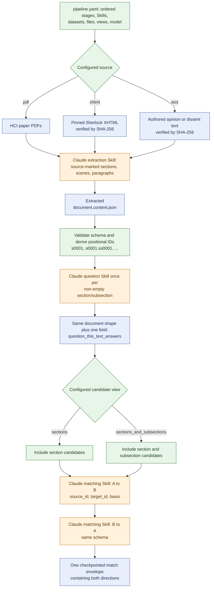
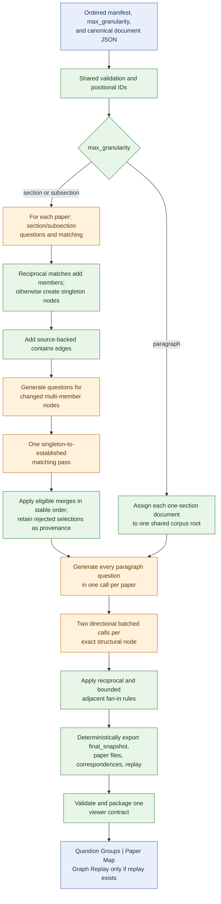

# Pipeline flow

The active workflow uses one nested document contract and one Claude Skills
interface. Green steps are deterministic. Orange steps are model judgments.

## Document pipeline

The harness also writes `runs.jsonl`, `errors.jsonl`, Skill/source/output
hashes, and stage checkpoints for audit and retry. These records do not alter
the pipeline flow. Extraction returns structured JSON to Python rather than
having Claude create and reread an output file. Every model call uses the
configured effort, thinking, prompt, attachment, input-token, and output-token
limits. Each judgment is one Messages API request; the adapter never sends the
response back as a follow-up turn.

Both matching stages use the same candidate and output contracts. They differ
only in candidate inclusion and the configured Skill. Candidate views exist in
memory, so no flat or nested duplicate input files are written.

## Incremental graph

The graph runner also appends match attempts and graph events and checkpoints
every stage for audit and retry. These records do not alter graph construction.

Every orange graph step uses a configured Claude Skill. Question judgments
return `question_this_text_answers`; match judgments return `target_id` and
`basis`. Python supplies complete evidence, constrains IDs, validates output,
and controls all graph mutation. Match selections that are not accepted by a
deterministic rule never become graph edges.

The pairwise match envelope is intentionally not fed into the incremental graph:
pairwise document matching permits multiple targets, while an insertion-round
graph judgment selects one existing node or none. They share document, ID,
question, candidate, and field conventions without pretending those two
different decisions are interchangeable.

`python -m pipeline.study --dataset <id>` automates the useful handoff. Section
and subsection modes run document questions before graphing. Paragraph mode
reuses extraction, flattens each document deterministically, and lets the graph
runner generate paragraph questions. Both paths write the ordered manifest,
invoke the graph, and package the viewer without manual file selection.

## Outbound calls

| Trigger | Endpoint purpose | Skipped when |
|---|---|---|
| Missing pinned Sherlock source | HTTPS download from the configured immutable URL | Verified source is cached |
| First use of a changed Skill | Anthropic Skills create/version | Skill hash is registered |
| Extraction | Anthropic Files plus beta Messages/Skill execution | Valid content artifact exists |
| Question or match judgment | Anthropic beta Messages/Skill execution | Valid checkpoint or content-addressed cache exists |

Viewer packaging and browser rendering make no model calls. The retained
`pipeline/graph_sme/` proposition graph is a separate legacy experiment with a
different semantic object, not an alternate document-pipeline format.
