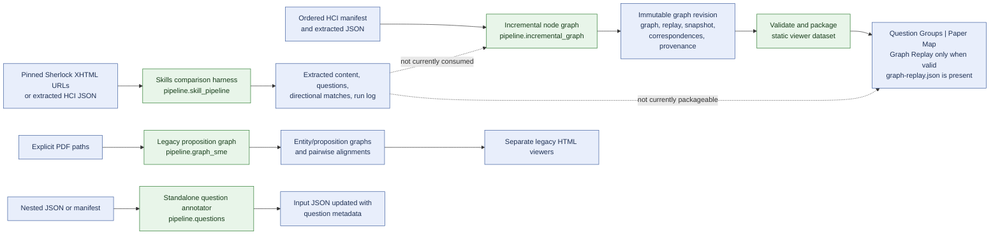
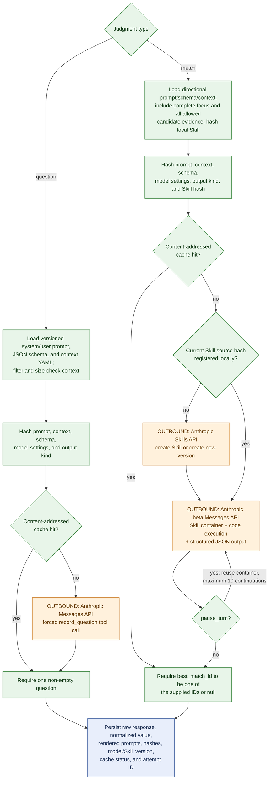
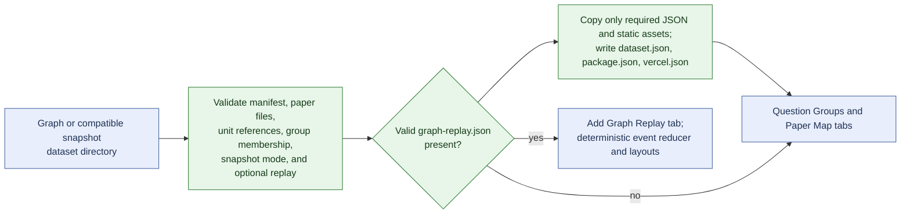
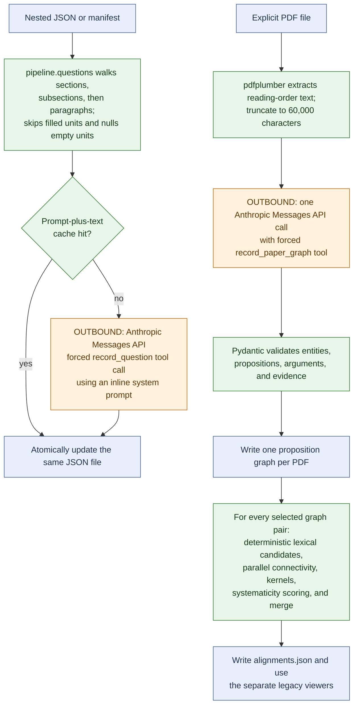

# Current pipeline flow

This document describes the code that exists now. It separates deterministic
local work from nondeterministic Claude judgments and from other network calls.
It does not include proposed graph behavior.

Color key:

- Green: deterministic local code.
- Orange: Claude judgment or Anthropic API operation.
- Red: non-Anthropic outbound network call.
- Blue: configuration, input, or persisted artifact.
- Dashed gray: an intentional separation or currently missing connection.

## Repository map

The Skills comparison harness and incremental graph share the Anthropic Skills
adapter, but they are separate pipelines. Match JSON from the harness is not an
input to the graph pipeline.

## Incremental node graph

```mermaid
flowchart TD
    CLI{"CLI command"}:::det
    Validate["validate: load and summarize inputs<br/>No model calls or writes"]:::det
    Run["run: resolve ordered manifest,<br/>pipeline YAML, prompts, contexts,<br/>schemas, and Skill directory"]:::det
    Retry["retry: read run.json from a<br/>previous successful run"]:::det
    Revision["Create a new immutable<br/>revision directory"]:::artifact

    CLI -->|validate| Validate
    CLI -->|run| Run
    CLI -->|retry| Retry
    Run --> Revision
    Retry -->|same manifest and insertion order;<br/>force one paper-stage pair| Revision

    Revision --> Normalize["Load every paper JSON; drop empty units;<br/>normalize stable paper, section, subsection,<br/>and paragraph IDs; retain hierarchy and ordinals"]:::det
    Revision -. "throughout the run" .-> AuditTrail["Append provenance/attempts.jsonl and<br/>provenance/events.jsonl; checkpoint every<br/>completed stage under stages/"]:::artifact

    subgraph Structural["Structural phase: repeat for each paper in manifest order"]
        AddPaper["Record paper_added and build<br/>section/paragraph lookup tables"]:::det
        UnitQuestions["For every section and subsection:<br/>reuse its question, or request [Q]<br/>from its complete text"]:::det
        CandidateCheck{"Are established<br/>structural nodes available?"}:::det
        BothDirections["For every new unit: [M] against all nodes<br/>For every node: [M] against all new units<br/>One best candidate or none per call"]:::det
        MatchEvents["Record every directional selection,<br/>candidate list, response, and attempt"]:::artifact
        Reconcile["Compute reciprocal pairs only"]:::det
        JoinOrCreate["Reciprocal: add unit to existing node<br/>Otherwise: create isolated singleton node"]:::det
        Hierarchy["Add paper-specific contains edges<br/>from section nodes to subsection nodes"]:::det
        StructuralNodeQuestions["For every structural node:<br/>singleton copies its member question;<br/>multi-member node requests [Q]"]:::det

        AddPaper --> UnitQuestions --> CandidateCheck
        CandidateCheck -->|yes| BothDirections --> MatchEvents --> Reconcile
        CandidateCheck -->|no; first paper| Reconcile
        Reconcile --> JoinOrCreate --> Hierarchy --> StructuralNodeQuestions
    end

    Normalize --> AddPaper
    StructuralNodeQuestions --> MoreStructural{"Another paper?"}:::det
    MoreStructural -->|yes| AddPaper

    subgraph Rerepresentation["One frozen structural rerepresentation pass after all papers"]
        Freeze["Freeze current singleton and<br/>established multi-member node lists"]:::det
        Eligible["For each singleton, deterministically remove<br/>targets already containing that paper"]:::det
        SingletonMatch["Request [M] from singleton to<br/>all eligible established nodes<br/>No reciprocal call"]:::det
        StableMerge["Process selections in stable node-ID order"]:::det
        MergeDecision{"Selected target still<br/>eligible?"}:::det
        Merge["Merge singleton into target; rewire<br/>contains edges; create no match edge"]:::det
        Ignore["Keep decision as<br/>rerepresentation_merge_ignored provenance"]:::artifact
        RefreshStructural["Regenerate [Q] once for<br/>each changed structural node"]:::det

        Freeze --> Eligible --> SingletonMatch --> StableMerge --> MergeDecision
        MergeDecision -->|yes| Merge --> RefreshStructural
        MergeDecision -->|same-paper conflict| Ignore --> RefreshStructural
        MergeDecision -->|none| RefreshStructural
    end

    MoreStructural -->|no| Freeze

    subgraph Paragraphs["Paragraph phase: repeat for each paper after structural nodes are final"]
        ParagraphQuestions["For every paragraph: reuse its question,<br/>or request [Q] from paragraph text<br/>plus parent structural context"]:::det
        ExactScope["For each section/subsection, select only<br/>paragraph nodes inside its exact final node"]:::det
        ParagraphCandidates{"Are prior paragraph<br/>nodes available there?"}:::det
        ParagraphBothWays["For every new paragraph: [M] to all nodes<br/>For every node: [M] to all new paragraphs"]:::det
        ParagraphEvents["Record every directional result<br/>before graph mutation"]:::artifact
        ParagraphReconcile["Compute reciprocal paragraph pairs"]:::det
        ParagraphMutation["Reciprocal: add as core member<br/>Adjacent one-way claim: accepted fan-in<br/>Everything else: isolated singleton"]:::det
        ReverseFanIn["Existing one-way node may merge atomically<br/>only when every member is adjacent to a<br/>reciprocal core in the same exact node"]:::det
        ProjectedIgnored["A node selecting a unit absorbed elsewhere<br/>becomes projected_edge_ignored provenance;<br/>no projected edge is added"]:::artifact
        ParagraphNodeQuestions["For every paragraph node:<br/>singleton copies its member question;<br/>multi-member node requests [Q]"]:::det

        ParagraphQuestions --> ExactScope --> ParagraphCandidates
        ParagraphCandidates -->|yes| ParagraphBothWays --> ParagraphEvents --> ParagraphReconcile
        ParagraphCandidates -->|no; seed nodes| ParagraphReconcile
        ParagraphReconcile --> ParagraphMutation --> ReverseFanIn --> ProjectedIgnored --> ParagraphNodeQuestions
    end

    RefreshStructural --> ParagraphQuestions
    ParagraphNodeQuestions --> MoreParagraphs{"Another paper?"}:::det
    MoreParagraphs -->|yes| ParagraphQuestions

    MoreParagraphs -->|no| Finalize["Finalize append-only events and<br/>deterministically project graph state"]:::det
    Finalize --> Outputs["Write paper files, manifest, empty viewer-compatibility<br/>bidirectional_matches.json, graph.json, graph-replay.json,<br/>correspondences.json/.md, final_snapshot.json,<br/>events.json, and summary.json"]:::artifact
    Outputs --> RunMetadata["On success only: update run.json<br/>to point at the current revision"]:::artifact

    Revision -. "any uncaught exception" .-> AnyFailure["Abort the revision"]:::det
    AnyFailure --> Failure["Write failure.json in the new revision;<br/>do not advance run.json"]:::artifact

    Q["[Q] Claude question judgment"]:::llm
    M["[M] Claude best-or-none match judgment"]:::llm
    UnitQuestions -. missing question .-> Q
    StructuralNodeQuestions -. multi-member .-> Q
    RefreshStructural -. changed node .-> Q
    ParagraphQuestions -. missing question .-> Q
    ParagraphNodeQuestions -. multi-member .-> Q
    BothDirections -. each direction .-> M
    SingletonMatch -. each singleton .-> M
    ParagraphBothWays -. each direction .-> M

    classDef det fill:#e8f5e9,stroke:#2e7d32,color:#163c19;
    classDef llm fill:#fff1dc,stroke:#c46b08,color:#623704;
    classDef artifact fill:#e8eefb,stroke:#3f5f9f,color:#1f3154;
```

Structural correspondence is represented by node membership. The only graph
edges produced by this pipeline are `contains` hierarchy edges. Unrequited match
selections are provenance unless they satisfy the explicitly bounded structural
rerepresentation or adjacent paragraph fan-in rules.

### Graph judgment boundary

The API key comes from `ANTHROPIC_API_KEY` or the first ancestor `.env` file.
Existing questions and singleton-node questions bypass Claude. A cache hit also
bypasses all Anthropic endpoints.

## Skills comparison harness

```mermaid
flowchart TD
    HCli["CLI: select config, dataset,<br/>stage, and optional --force"]:::det
    HConfig["Load pipeline.yaml; validate stage IDs,<br/>Skill keys, views, document IDs,<br/>question selections, and match pairs"]:::det
    Dataset{"Dataset"}:::det
    ExistingPrepare{"Both prepared output files<br/>exist and --force is false?"}:::det

    HCIInput["Load checked-in HCI nested JSON;<br/>strip all generated question fields"]:::det
    SourceCache{"Pinned XHTML exists locally<br/>with configured SHA-256?"}:::det
    GitHub["OUTBOUND: HTTPS GET from pinned<br/>raw.githubusercontent.com URL"]:::network
    VerifySource["Verify exact source SHA-256"]:::det
    ExtractCall["OUTBOUND: register extraction Skill;<br/>upload XHTML with Anthropic Files API;<br/>run beta Messages API with Skill/code execution;<br/>retrieve metadata and download generated JSON"]:::llm

    ValidateShape["Validate strict nested schema;<br/>for Sherlock, require configured section count<br/>and Scene 1..N from explicit source separators"]:::det
    PrepareOutputs["Write nested-content.json and deterministic<br/>flattened content.json; checkpoint provenance"]:::artifact

    Questions["For each configured question document,<br/>then each section and subsection in order"]:::det
    QuestionReady{"Question already present<br/>and --force is false?"}:::det
    EmptyUnit{"Unit has paragraphs?"}:::det
    NullQuestion["Write null without a model call"]:::det
    QuestionSkill["OUTBOUND: register question Skill;<br/>beta Messages API structured call<br/>with complete unit paragraphs"]:::llm
    CheckpointQuestion["Validate non-empty question and atomically<br/>checkpoint nested-questions.json after each unit;<br/>write deterministic flat questions file"]:::artifact

    MatchStage{"Configured matching stage"}:::det
    FlatCandidates["section_matching:<br/>one whole top-level section candidate"]:::det
    NestedCandidates["section_and_subsection_matching:<br/>whole section with all descendant paragraphs<br/>plus each subsection as its own candidate"]:::det
    Direction["Run A to B, then B to A"]:::det
    ExistingMatch{"Directional output exists<br/>and --force is false?"}:::det
    Batch["Build stable source batches;<br/>nested default is one source candidate;<br/>every batch receives the full target pool"]:::det
    MatchSkill["OUTBOUND: register selected matching Skill;<br/>beta Messages API structured call;<br/>multiple targets or null are allowed"]:::llm
    MatchValidate["Normalize only uniquely resolvable IDs;<br/>validate identifiers, null consistency,<br/>non-empty basis, no duplicate pair,<br/>and coverage of every source candidate"]:::det
    RetryMatch{"Valid response?"}:::det
    Rejected["Save rejected/raw response and error log;<br/>retry validation failures up to configured limit;<br/>retry HTTP 408/409/429 and 5xx"]:::artifact
    DirectionalFile["Write each valid batch and<br/>directional match JSON"]:::artifact
    Combined["After both directions validate,<br/>write combined p1-p2 / p2-p1 JSON"]:::artifact
    RunLog["Append runs.jsonl with timestamp, model,<br/>response ID, token usage, Skill ID/version/hash,<br/>input/output hashes, and normalizations"]:::artifact
    Stop["Stop. No node construction, graph rules,<br/>node questions, classification, or viewer packaging"]:::gap

    HCli --> HConfig --> Dataset --> ExistingPrepare
    ExistingPrepare -->|yes| ValidateShape
    ExistingPrepare -->|no; HCI| HCIInput --> ValidateShape
    ExistingPrepare -->|no; Sherlock| SourceCache
    SourceCache -->|yes| VerifySource
    SourceCache -->|no or hash mismatch| GitHub --> VerifySource
    VerifySource --> ExtractCall --> ValidateShape
    ValidateShape --> PrepareOutputs --> Questions

    Questions --> QuestionReady
    QuestionReady -->|yes| Questions
    QuestionReady -->|no| EmptyUnit
    EmptyUnit -->|no| NullQuestion --> Questions
    EmptyUnit -->|yes| QuestionSkill --> CheckpointQuestion --> RunLog --> Questions

    Questions -->|all selected units complete| MatchStage
    MatchStage -->|sections| FlatCandidates --> Direction
    MatchStage -->|sections and subsections| NestedCandidates --> Direction
    Direction --> ExistingMatch
    ExistingMatch -->|yes; validate and reuse| DirectionalFile
    ExistingMatch -->|no| Batch --> MatchSkill --> MatchValidate --> RetryMatch
    RetryMatch -->|no| Rejected --> MatchSkill
    RetryMatch -->|yes| DirectionalFile --> RunLog
    DirectionalFile --> MoreDirections{"Both directions complete?"}:::det
    MoreDirections -->|no| Direction
    MoreDirections -->|yes| Combined --> Stop

    classDef det fill:#e8f5e9,stroke:#2e7d32,color:#163c19;
    classDef llm fill:#fff1dc,stroke:#c46b08,color:#623704;
    classDef network fill:#fde8e8,stroke:#b23b3b,color:#5b2020;
    classDef artifact fill:#e8eefb,stroke:#3f5f9f,color:#1f3154;
    classDef gap fill:#f3f3f3,stroke:#777,color:#333,stroke-dasharray:5 5;
```

Prepared outputs are reused by filename after schema validation. This harness
does not automatically invalidate them when a Skill, source, or candidate view
changes; use `--force` or a fresh `output_dir`. Its generated files live under
`runs/skill-pipeline/` and are ignored by Git.

Entering the question or matching stage initializes the Anthropic client and
loads an API key before checking whether every final output can be reused. A
matching Skill is registered locally by source hash; the Skills API is contacted
only when that hash has no current registered version.

## Viewer packaging and runtime

Packaging and browser rendering make no Claude calls. The packaged UI is static;
its only runtime requests are HTTP reads of its own JSON and JavaScript assets.

## Other retained entry points

Neither retained entry point is called by the incremental graph or Skills
comparison CLI. They are independent utilities.

## Current run state

- Sherlock: five extracted stories; two question-annotated stories; flat and
  nested matching complete in both directions for the selected pair.
- HCI Skills comparison: two prepared and question-annotated papers; flat
  matching complete in both directions; nested forward matching complete;
  nested reverse matching has 8 of 37 valid batches, so no combined nested file.
- Incremental graph: deterministic tests and scripted viewer fixtures exist, but
  no real Anthropic-backed graph revision has completed successfully.

## Current non-steps

The following are not performed by current code:

- No deterministic `common_structure`, `alignable_difference`, or
  `non_alignable_difference` classification is calculated or exported.
- No child correspondence edge is created. `contains` is the only graph edge.
- No unrequited structural match is projected into a node-to-node edge.
- No Skills comparison output is converted into graph or viewer input.
- No node-level question is generated by the Skills comparison harness.
